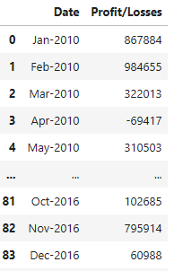
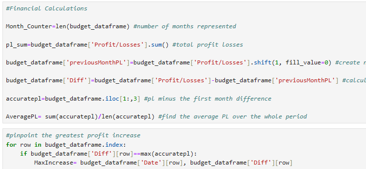
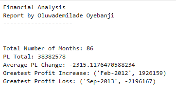

    
# Financial Analysis
    
##### Created by [Demi Oyebanji](mailto:oluwademiladeoyebanji@outlook.com) as an assignment for the **UofT SCS Financial Technology Bootcamp**
________________________________________________________________________________________________________

In this file I analyze a CSV file to try and stipulate financial information from it

The CSV file only had two columns: **Date** and **Profit/Losses**

There was still a lot of analysis that could be done:

* Find the sum of profit/losses
* Store the difference and average in profit/loss month over month

Then I print the results of all my analysis which includes the month with the **Greatest Profit Increase** and **Greatest Profit Loss**

